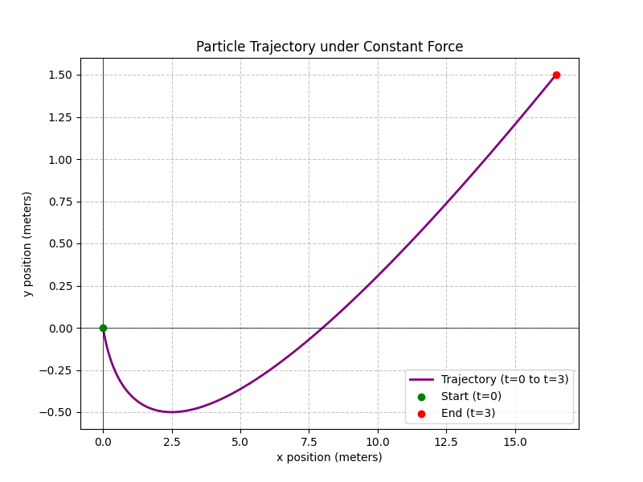

# Problem 12: Work and Energy with a Constant Force

### 1. Problem Statement

A constant force acts on a body of mass $m = 2\ \mathrm{kg}$:
$$\vec F = [6, 2]\ \mathrm{N}$$

The body starts with an initial velocity $\vec v(0) = (1, -1)\ \mathrm{\frac{m}{s}}$ from the point $\vec r(0)=(0,0)\ \mathrm{m}$.

- Determine $\vec a(t)$.
- Determine $\vec v(t)$.
- Determine $\vec r(t)$.
- Draw the trajectory of the motion.
- Calculate the work done by the force at time $t=3\ \mathrm{s}$.
- Check the consistency with the work-energy theorem.

---

### 2. Solution and Explanation

**Concept Intuition:**
Because the force is constant, the acceleration will also be constant. This means we can integrate step-by-step from Acceleration $\rightarrow$ Velocity $\rightarrow$ Position using basic calculus.

Once we have the position and velocity at exactly $t=3\ \mathrm{s}$, we can calculate the Work done mechanically ($W = \vec{F} \cdot \Delta\vec{r}$) and compare it to the change in Kinetic Energy ($\Delta K = K_f - K_i$). If the laws of physics hold true, these two numbers will be perfectly identical.

#### Step 1: Determine Acceleration ($\vec a(t)$)

Using Newton's Second Law ($\vec{F} = m\vec{a}$), we isolate acceleration by dividing the force vector by the mass ($m=2\ \mathrm{kg}$).
$$\vec{a}(t) = \frac{\vec{F}}{m} = \frac{(6, 2)}{2}$$
$$\vec{a}(t) = (3, 1)\ \mathrm{\frac{m}{s^2}}$$

#### Step 2: Determine Velocity ($\vec v(t)$)

Velocity is the integral of acceleration. We integrate our constant acceleration and add the initial velocity $\vec{v}(0) = (1, -1)$ as our constant of integration.
$$\vec{v}(t) = \int \vec{a}(t)\, dt + \vec{v}(0)$$
$$\vec{v}(t) = (3t, 1t) + (1, -1)$$
$$\vec{v}(t) = (3t + 1, t - 1)\ \mathrm{\frac{m}{s}}$$

#### Step 3: Determine Position ($\vec r(t)$)

Position is the integral of velocity. We integrate our new velocity vector and add the initial position $\vec{r}(0) = (0, 0)$.
$$\vec{r}(t) = \int \vec{v}(t)\, dt + \vec{r}(0)$$
$$\vec{r}(t) = \left( \frac{3}{2}t^2 + t, \frac{1}{2}t^2 - t \right) + (0, 0)$$
$$\vec{r}(t) = (1.5t^2 + t, 0.5t^2 - t)\ \mathrm{m}$$

#### Step 4: Calculate the Work Done at $t=3\ \mathrm{s}$

Work done by a constant force is the dot product of the Force vector and the Displacement vector ($\Delta\vec{r}$).
First, we find the exact position at $t=3$:
$$\vec{r}(3) = (1.5(3)^2 + 3, 0.5(3)^2 - 3)$$
$$\vec{r}(3) = (1.5(9) + 3, 0.5(9) - 3)$$
$$\vec{r}(3) = (13.5 + 3, 4.5 - 3)$$
$$\vec{r}(3) = (16.5, 1.5)\ \mathrm{m}$$

Since the starting position was $(0,0)$, the displacement $\Delta\vec{r}$ is simply $(16.5, 1.5)$.
Now, calculate the dot product with the Force $\vec{F} = (6, 2)$:
$$W = \vec{F} \cdot \Delta\vec{r}$$
$$W = (6 \cdot 16.5) + (2 \cdot 1.5)$$
$$W = 99 + 3$$
$$W = 102\ \mathrm{J}$$

#### Step 5: Check Consistency with the Work-Energy Theorem

The Work-Energy Theorem states that Work equals the change in Kinetic Energy: $W = K_f - K_i$.
Kinetic energy is calculated using $K = \frac{1}{2}mv^2$. The $v^2$ is the magnitude of the velocity vector squared ($v_x^2 + v_y^2$).

**Initial Kinetic Energy ($t=0$):**
We know $\vec{v}(0) = (1, -1)$.
$$v(0)^2 = (1)^2 + (-1)^2 = 1 + 1 = 2$$
$$K_i = \frac{1}{2}(2\ \mathrm{kg})(2) = 2\ \mathrm{J}$$

**Final Kinetic Energy ($t=3$):**
First, find the velocity vector at $t=3$:
$$\vec{v}(3) = (3(3) + 1, 3 - 1) = (10, 2)\ \mathrm{\frac{m}{s}}$$
$$v(3)^2 = (10)^2 + (2)^2 = 100 + 4 = 104$$
$$K_f = \frac{1}{2}(2\ \mathrm{kg})(104) = 104\ \mathrm{J}$$

**The Change in Kinetic Energy ($\Delta K$):**
$$\Delta K = K_f - K_i = 104\ \mathrm{J} - 2\ \mathrm{J} = 102\ \mathrm{J}$$

**Conclusion:** The calculated work ($102\ \mathrm{J}$) perfectly matches the change in kinetic energy ($102\ \mathrm{J}$). The theorem is fully consistent.

---

