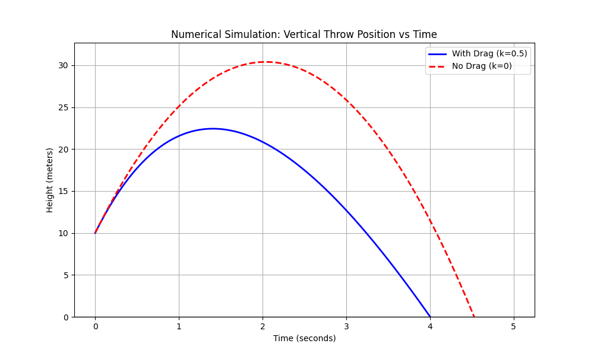

# Problem 9: Vertical Throw with Drag

### 1. Problem Statement

We have the equation of motion for a vertical throw with air resistance (drag):
$$m\frac{dv}{dt} = -mg - kv$$
with initial conditions $v(0)=v_0$, $x(0)=10$.

- Solve the equation by analytical methods.
- Determine the maximum height.
- Compare with the case without drag.
- Perform a numerical simulation using Python.

---

### 2. Analytical Solution

**Step 1: Solve for Velocity $v(t)$**
We start by separating the variables to integrate the differential equation:
$$m \frac{dv}{dt} = -\left(mg + kv\right)$$
$$\frac{dv}{mg + kv} = -\frac{dt}{m}$$

Integrate both sides:
$$\int \frac{1}{mg + kv} dv = \int -\frac{1}{m} dt$$
$$\frac{1}{k} \ln|mg + kv| = -\frac{t}{m} + C_1$$

Apply the initial condition $v(0) = v_0$ to find the constant $C_1$:
$$C_1 = \frac{1}{k} \ln|mg + kv_0|$$

Substitute $C_1$ back and solve for $v(t)$:
$$\frac{1}{k} \ln\left| \frac{mg + kv}{mg + kv_0} \right| = -\frac{t}{m}$$
$$\ln\left| \frac{mg + kv}{mg + kv_0} \right| = -\frac{kt}{m}$$
$$\frac{mg + kv}{mg + kv_0} = e^{-\frac{kt}{m}}$$
$$kv = (mg + kv_0)e^{-\frac{kt}{m}} - mg$$

**Velocity Function:**
$$v(t) = \left(v_0 + \frac{mg}{k}\right)e^{-\frac{kt}{m}} - \frac{mg}{k}$$

**Step 2: Solve for Position $x(t)$**
Since $v(t) = \frac{dx}{dt}$, we integrate the velocity function to find position:
$$x(t) = \int \left[ \left(v_0 + \frac{mg}{k}\right)e^{-\frac{kt}{m}} - \frac{mg}{k} \right] dt$$
$$x(t) = -\frac{m}{k}\left(v_0 + \frac{mg}{k}\right)e^{-\frac{kt}{m}} - \frac{mg}{k}t + C_2$$

Apply the initial condition $x(0) = 10$ to find $C_2$:
$$10 = -\frac{m}{k}\left(v_0 + \frac{mg}{k}\right) + C_2$$
$$C_2 = 10 + \frac{m}{k}\left(v_0 + \frac{mg}{k}\right)$$

Substitute $C_2$ back to get the final position equation:

**Position Function:**
$$x(t) = 10 + \frac{m}{k}\left(v_0 + \frac{mg}{k}\right) \left(1 - e^{-\frac{kt}{m}}\right) - \frac{mg}{k}t$$

---

### 3. Maximum Height

The maximum height is reached when the upward velocity reaches zero ($v(t_{max}) = 0$).
$$0 = \left(v_0 + \frac{mg}{k}\right)e^{-\frac{k}{m}t_{max}} - \frac{mg}{k}$$
$$e^{-\frac{k}{m}t_{max}} = \frac{mg}{kv_0 + mg}$$

Solve for $t_{max}$:
$$t_{max} = \frac{m}{k} \ln\left(1 + \frac{kv_0}{mg}\right)$$

Substitute $t_{max}$ into the position function $x(t)$:
$$x_{max} = 10 + \frac{m}{k}\left(v_0 + \frac{mg}{k}\right) \left(1 - \frac{mg}{kv_0 + mg}\right) - \frac{mg}{k} \left[ \frac{m}{k} \ln\left(1 + \frac{kv_0}{mg}\right) \right]$$

Simplifying this yields the **Maximum Height:**
$$x_{max} = 10 + \frac{mv_0}{k} - \frac{m^2g}{k^2} \ln\left(1 + \frac{kv_0}{mg}\right)$$

---

### 4. Comparison with No Drag ($k = 0$)

If we remove air resistance ($k = 0$), the equations simplify to standard kinematic parabolas:

- **Velocity:** $v(t) = v_0 - gt$
- **Position:** $x(t) = 10 + v_0t - \frac{1}{2}gt^2$
- **Max Height:** $x_{max} = 10 + \frac{v_0^2}{2g}$

**Key Differences:**

1.  **Lower Peak:** With drag, mechanical energy is constantly lost to the air, resulting in a significantly lower maximum height.
2.  **Asymmetry:** Without drag, the time going up equals the time going down. With drag, the object slows down faster on the way up, but falls slower on the way down, breaking the symmetrical parabola.
3.  **Terminal Velocity:** Without drag, a falling object accelerates infinitely. With drag, the object will eventually stop accelerating and hit a constant terminal velocity ($v_{term} = -\frac{mg}{k}$).

---

### 5. Numerical Simulation (Python)

To simulate this numerically, we use SciPy's `solve_ivp`. In scientific computing, using optimized, vectorized solvers is standard best practice over writing manual integration loops.
