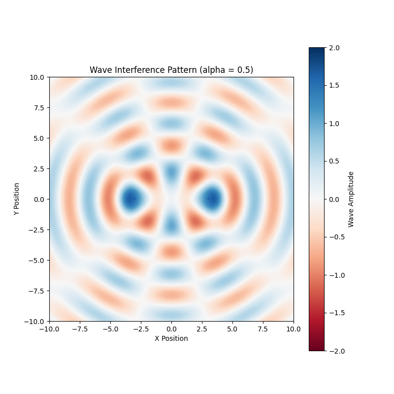

# Problem 10: Wave Sources and Superposition

### 1. Problem Statement

Create an animation/simulation showing the superposition of waves from multiple point sources. The wave equation for a single source is given by:
$$u(\vec{r},t) = \frac{A}{|\vec{r}-\vec{r_0}|^\alpha} \sin(k |\vec{r} - \vec{r_0}| - \omega t)$$

where $\vec{r_0}$ is the position of the wave source, and $\alpha$ is a parameter that dictates amplitude decay, range $[0, 2]$.

---

### 2. Solution and Explanation

**Concept Intuition:**
Think of this problem exactly like writing a "Fragment Shader" in graphics programming.
You have a 2D screen made of pixels, and you have multiple "emitter" objects placed on that screen. To find the exact color (or height) of any specific pixel $\vec{r}=(x,y)$, you must run a loop calculating the exact Euclidean distance from that pixel to every single emitter $\vec{r_0}$.

Once you have the distance vector ($|\vec{r} - \vec{r_0}|$), you pass it into the wave equation. This equation does two things:

1.  **The Sine Function:** Calculates the phase of the wave (is it currently a peak or a trough at this exact time $t$?).
2.  **The Decay Factor:** Divides the amplitude by the distance raised to the power of $\alpha$. If $\alpha=0$, the wave travels forever without losing strength. If $\alpha=2$, the wave dissipates extremely quickly (Inverse-Square Law).

Finally, **Superposition** simply means you take the output from Emitter 1 and add it to the output of Emitter 2. If two peaks overlap, they add together (Constructive Interference). If a peak and a trough overlap, they sum to zero (Destructive Interference).

#### Step 1: Parsing the Mathematics

- **$|\vec{r} - \vec{r_0}|$**: The spatial distance $d = \sqrt{(x - x_0)^2 + (y - y_0)^2}$.
- **$\frac{A}{d^\alpha}$**: The Amplitude Decay. This controls how far the wave propagates before dying out.
- **$\sin(kd - \omega t)$**: The traveling phase. The wave number $k$ controls the wavelength, and $\omega$ controls the speed of the ripples over time $t$.

---

### 3. Python Simulation (Vectorized Superposition)

In scientific computing, calculating this pixel-by-pixel using standard `for` loops is incredibly slow. Instead, we use `numpy.meshgrid` to evaluate the entire 2D space simultaneously.

