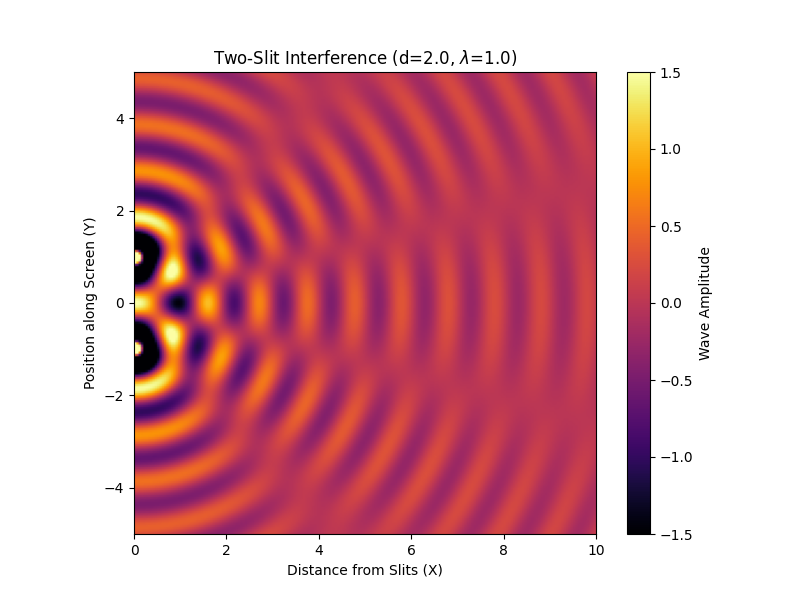

# Problem 11: Two-Slit Interference

### 1. Problem Statement

Create an animation visualizing the two-slit interference pattern using the superposition equation:
$$u(\vec{r},t) = \frac{A}{|\vec{r}-\vec{r_1}|} \sin(k |\vec{r} - \vec{r_1}| - \omega t) + \frac{A}{|\vec{r}-\vec{r_2}|} \sin(k |\vec{r} - \vec{r_2}| - \omega t)$$

where $\vec{r_1}$ and $\vec{r_2}$ are the position vectors of the slits. The user should be able to change the distance between the slits $d = |\vec{r_1} - \vec{r_2}|$ and the wavelength $\lambda$. The animation should visualize the resulting interference pattern in real time.

---

### 2. Solution and Explanation

**Concept Intuition:**
This is the mathematical engine behind Young's Double Slit Experiment. When a single wave hits a wall with two tiny slits, those slits act as two brand new, perfectly synchronized "emitters."

Because the waves leave the slits at the exact same time, their overlapping ripples create a highly structured geometric pattern on a screen across the room:

- **Constructive Interference (Bright Bands):** If the distance from Slit 1 to a pixel and the distance from Slit 2 to a pixel differ by exactly a full wavelength ($1\lambda, 2\lambda, 3\lambda$), the wave peaks perfectly align and double in strength.
- **Destructive Interference (Dark Bands):** If the distances differ by a half-step ($0.5\lambda, 1.5\lambda$), a peak perfectly overlaps with a trough, resulting in a mathematical zero. The waves completely cancel each other out, leaving a dark spot.

By changing the slit distance ($d$) or the physical size of the wave ($\lambda$), you directly alter the geometry of these overlapping paths, which completely reshapes the resulting data pattern.

#### Step 1: Mapping the Variables

To build this, we map the requested controls to the physics equation:

- **Wavelength ($\lambda$):** We control this by dynamically updating the wave number $k$ inside the sine function ($k = \frac{2\pi}{\lambda}$).
- **Slit Distance ($d$):** We control this by moving the $\vec{r_1}$ and $\vec{r_2}$ coordinates along the Y-axis. If the center is $y=0$, then $\vec{r_1}$ is at $+d/2$ and $\vec{r_2}$ is at $-d/2$.

---

### 3. Python Simulation (Vectorized Interference)

We use `numpy` to generate a 2D meshgrid and calculate the interference pattern exactly as an AI image processing algorithm would—via highly optimized matrix addition.

