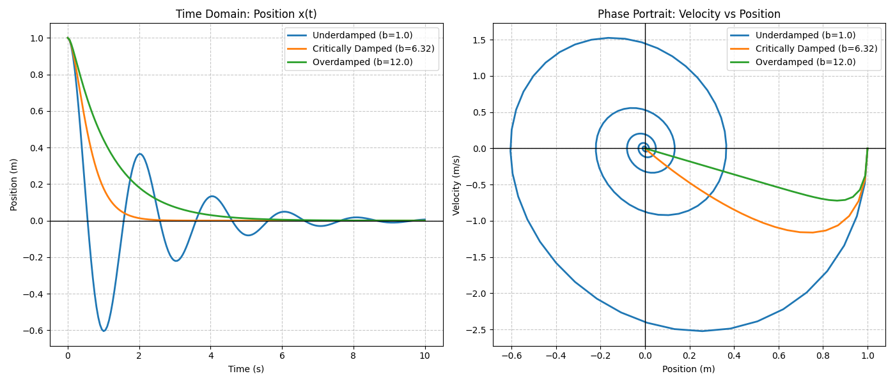

# Problem 9: Damped Harmonic Oscillator

### 1. Problem Statement

For the given equation describing a damped harmonic oscillator:
$$m \frac{d^2 x}{dt^2} + b \frac{dx}{dt} + k x = 0$$

1. Write down the general solution.
2. Present the classification of cases: underdamped, critically damped, overdamped.
3. Solve the equation numerically (RK4).
4. Investigate the effect of parameter $b$.
5. Generate the graph of $x(t)$.
6. Generate the phase portrait.

---

### 2. Analytical Solution & Classification

**Concept Intuition:**
Think of the damping parameter ($b$) as a mechanical brake or fluid resistance (like a car's shock absorber or an automatic door closer).

- The spring ($k$) wants to bounce forever.
- The mass ($m$) carries the momentum.
- The damper ($b$) drains the kinetic energy out of the system.

To solve this mathematically, we rewrite the differential equation by dividing by $m$:
$$\frac{d^2 x}{dt^2} + \frac{b}{m} \frac{dx}{dt} + \frac{k}{m} x = 0$$

Let $\gamma = \frac{b}{2m}$ (the damping ratio) and $\omega_0 = \sqrt{\frac{k}{m}}$ (the natural, undamped frequency). The characteristic equation is $r^2 + 2\gamma r + \omega_0^2 = 0$, giving the roots:
$$r = -\gamma \pm \sqrt{\gamma^2 - \omega_0^2}$$

The physical behavior of the system is entirely dictated by the value of $b$ inside that square root.

#### Case 1: Underdamped ($b^2 < 4mk$)

The resistance is weak. The square root produces an imaginary number, causing the system to oscillate back and forth, but with a gradually decaying amplitude.
**General Solution:**
$$x(t) = e^{-\gamma t} \left( A \cos(\omega_d t) + B \sin(\omega_d t) \right)$$
_(Where $\omega_d = \sqrt{\omega_0^2 - \gamma^2}$ is the damped frequency)._

#### Case 2: Critically Damped ($b^2 = 4mk$)

The "Goldilocks" zone. The square root becomes exactly zero. This represents the absolute fastest way the system can return to its resting position ($0$) without accidentally overshooting and bouncing. (This is how car suspensions and automatic doors are tuned).
**General Solution:**
$$x(t) = (A + Bt)e^{-\gamma t}$$

#### Case 3: Overdamped ($b^2 > 4mk$)

The resistance is massive (imagine the spring is submerged in thick honey). The square root is positive and real. The system does not bounce at all; it just slowly and sluggishly creeps back toward the center point.
**General Solution:**
$$x(t) = A e^{r_1 t} + B e^{r_2 t}$$

---

### 3. Numerical Simulation (RK4 Algorithm in Python)

To solve this numerically, we convert the 2nd-order differential equation into a system of two 1st-order equations. This is the standard architecture for physics engines.
Let $v = \frac{dx}{dt}$.

1. $\frac{dx}{dt} = v$
2. $\frac{dv}{dt} = -\frac{b}{m}v - \frac{k}{m}x$

We will implement the **4th-Order Runge-Kutta (RK4)** method, which is the industry standard for numerical integration because it samples the curve 4 times per time-step to minimize error, making it vastly superior to the basic Euler method.

